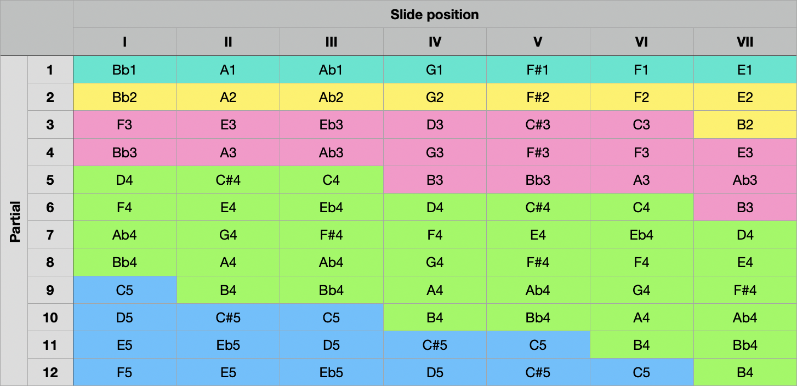

# Trombone Lip Break Finder

This project is a tool for trombone players to find possible melodies using lip breaks.

The latest version of the tool is currently available in the following URL:

[https://akkujii.github.io/lip-break-finder/](https://akkujii.github.io/lip-break-finder/)

## What is a lip break

In short, lip break is a technique to create distinction (also called legato) between two notes when moving from note to another without using tongue. The technique relies on moving from overtone partial to another.

The table below lists notes which can be naturally played on a trombone from partials 1 to 12 which is considered as a good range for a professional trombone player.

### Example 1

If a player plays a middle C (C4) using slide position 3 (column III) and partial 5 (row 5) the player can use lip break technique to transition to any note on partials 4 or 6. Note that the player can play the same note again by moving to C4 on slide position 6 on partial 6.

### Example 2

If a player plays E4 from position 2, partial 6 and is willing to move to F4 if one moves the slide from position 2 to position 1 and stays on the same partial using tongue is required for legato to avoid sliding from note to another (glissando). Using lip break a player can move to F4 in position IV on partial 7.

## Resources

- [Wikipedia: Harmonic series (music)](https://en.wikipedia.org/wiki/Harmonic_series_(music))
- [Doctoral Thesis by Antti Rissanen: Vetopasuunan soittotekniikan kehittäminen luonnonsävelsarjoihin perustuvalla lip-break-artikulaatiotekniikalla (in Finnish)](https://taju.uniarts.fi/handle/10024/6636)
